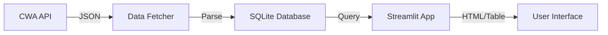

# Design: CWA Weather App

## Architecture

### Components

1.  **Data Fetcher (`etl.py`)**:
    -   Connects to CWA API with API Key.
    -   Downloads JSON (F-A0010-001).
    -   Transforms JSON: Extracts Location, Temperature, Time.
    -   Handles errors and logging.

2.  **Database Layer (`database.py`)**:
    -   Manages `data.db` SQLite connection.
    -   Schema: `weather_data` table (id, city, town, temperature, obs_time).
    -   Functions: `init_db()`, `save_weather_data()`, `get_weather_data()`.

3.  **User Interface (`app.py`)**:
    -   Streamlit application main entry point.
    -   Calls `database.get_weather_data()`.
    -   Renders a responsive table using `st.dataframe` or `st.table`.
    -   Styles: Custom CSS to match CWA aesthetics (headers, colors).

## Data Model

### Table: `weather_data`
| Column        | Type    | Description            |
| :------------ | :------ | :--------------------- |
| `id`          | INTEGER | Primary Key            |
| `city`        | TEXT    | e.g., "Taipei City"    |
| `town`        | TEXT    | e.g., "Xinyi District" |
| `temperature` | REAL    | Celsius                |
| `obs_time`    | TEXT    | Observation Time       |

## Data Flow
-   **Init**: App checks/creates DB on startup.
-   **Update**: Button "Refresh Data" triggers `etl.py` logic.
-   **View**: Default view queries DB and shows table.
